# **Microsoft-Fabric-Project-NYC-Taxi-Analysis**

## **Introduction:**
This project analyzes one year of NYC Yellow Taxi trip data using Microsoft Fabric. 
The goal is to ingest, process, and visualize large-scale transportation data 
to uncover patterns in trip volume, fares, distances, and peak travel times. 
By leveraging Fabric’s end-to-end analytics capabilities, the project demonstrates scalable data engineering, 
analytics, and reporting for real-world urban mobility data.

## **Datasets:**
NYC Taxi trip record data
NYC Yellow Taxi data captures detailed information about taxi trips across New York City, including pickup and drop-off locations, trip duration, and fares. It is widely used to analyze urban mobility patterns, demand trends, and transportation efficiency.

dataset used for this project : \
source of the dataset : https://www.nyc.gov/site/tlc/about/tlc-trip-record-data.page \
We have taken data for the year 2024 into consideration for this project.

## **Project Overview:**
In this project we have used 2 pipelines to ingest, process and prepare business ready data.

1. to ingest and clean data from the landing zone to staging schema.
2. to use the data from the staging schema and make it presentation ready and load in presentation schema.

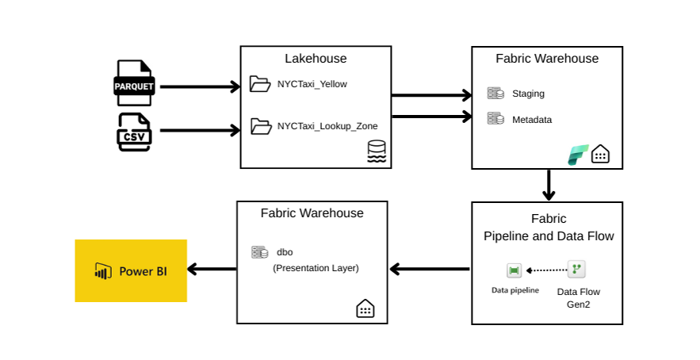

# **Project Steps:**

1. Create a workspace for NYC taxi project : NYC_Taxi_Fabric_Project.
2. Create a Lakehouse as landing zone for all the data files : NYCTaxiLakehouse
3. Create two separate folders inside NYCTaxiLakehouse:
    - NYCTaxi_Yellow
    - NYCTaxi_Lookup_Zone
4. Now upload the NYC Taxi trip data files in NYCTaxi_Yellow folder. There are total 12 parquet files for the year 2024(jan to dec).
    - yellow_tripdata_2024-01
    - yellow_tripdata_2024-02
    - yellow_tripdata_2024-03
    - yellow_tripdata_2024-04
    - yellow_tripdata_2024-05
    - yellow_tripdata_2024-06
    - yellow_tripdata_2024-07
    - yellow_tripdata_2024-08
    - yellow_tripdata_2024-09
    - yellow_tripdata_2024-10
    - yellow_tripdata_2024-11
    - yellow_tripdata_2024-12

> [!IMPORTANT]
> Upload the January Datafile only first to test the pipelines.

5. Upload taxi_zone_lookup.csv files in NYCTaxi_Lookup_Zone folder.
6. Create a warehouse to host staging schema : NYCTaxi_Warehouse.
7. Now we will start working on our first pipeline to ingest data and store in NYCTaxi_Warehouse.

### **Pipeline 1:**
#### **pl_staging_zone_lookup_pipeline :**

   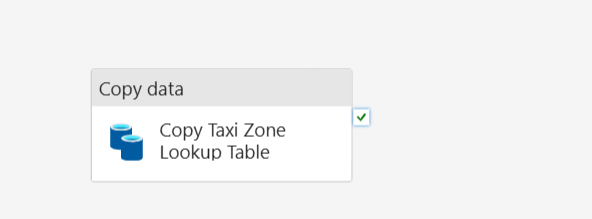 
     
#### **Pipeline Components:**
* Copy Activity: Copy Taxi Zone Lookup Table \
  Source: NYCTaxiLakehouse/NYCTaxi_Lookup_Zone/taxi_zone_lookup.csv \
  Destination: NYCTaxi_Warehouse.staging.taxi_zone_lookup (new table) \

Start working on our sesond pipeline to ingest data in NYCTaxi_Warehouse, staging schema.

### **Pipeline 2:**
#### **pl_staging_nyctaxi_processing_pipeline :**

    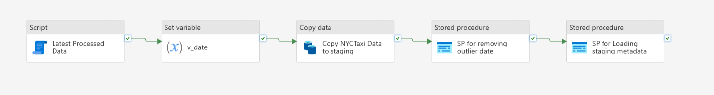
	
#### **Pipeline Components:**
**Script Activity : Latest Processed Data** 
   
        select top 1 
            latest_processed_pickup 
            from metadata.processing_log 
            where table_processed = 'staging.NYCTaxi_yellow' 
            order by latest_processed_pickup desc;

**Set Variable Activity :** v_date

           @formatDateTime(
    					addToTime(
        					activity('Latest Processed Data').output.resultSets[0].rows[0].latest_processed_pickup, 
        				1, 'Month'), 
    				'yyyy-MM')

**Copy Activity :**\
Copy NYCTaxi Data to staging

		Source : NYCTaxiLakehouse/NYCTaxi_Yellow/@concat('yellow_tripdata_',variables('v_date'),'.parquet')\
		Destination : NYCTaxi_Warehouse.staging.NYCTaxi_yellow (existing table)

**Stored Procedure Activity :** \
SP for removing outlier date\
Stored Procedure name : NYCTaxi_Warehouse.staging.p_staging_data_cleaning\
(this Stored procedure is created to clean the data, as we found that there are some outlier date data present in each file)
   
		CREATE OR ALTER procedure staging.p_staging_data_cleaning
			@start_date datetime2,
			@end_date datetime2
			AS 
		
			DELETE from staging.NYCTaxi_yellow
			   where tpep_dropoff_datetime < @start_date or tpep_pickup_datetime > @end_date;

**Stored procedure variables:**
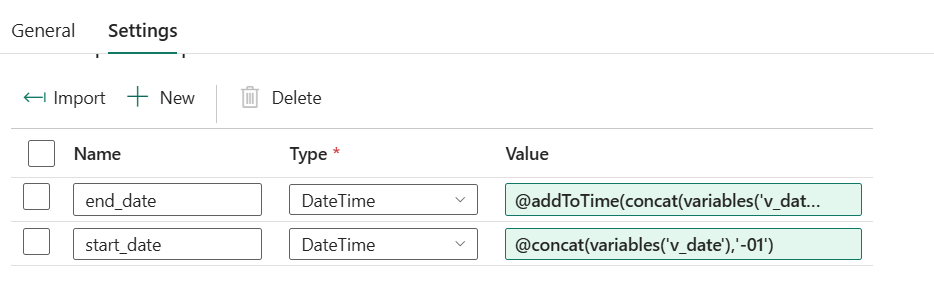

		end_date : @addToTime(concat(variables('v_date'),'-01'), 1, 'Month')
		start_date : @concat(variables('v_date'),'-01')

Before the next step create a new schema and table in NYCTaxi_Warehouse : \
    **schema:** metadata  
    **table:** processing_log
	
		create schema metadata;
		
		create table metadata.processing_log
		(
			pipeline_run_id varchar(255), 
			table_processed varchar(255), 
			rows_processed INT, 
			latest_processed_pickup datetime2(6),
			processed_datetime datetime2(6)
		);

**Stored Procedure Activity:** \
SP for Loading staging metadata
**Stored Procedure name:** NYCTaxi_Warehouse.metadata.insert_staging_metadata\
(this Stored procedure is created to create a transaction log for each pipeline run and store staging metadata)

**Stored procedure script:**

    
		CREATE OR ALTER   PROCEDURE metadata.insert_staging_metadata
					@pipeline_run_id VARCHAR(255),
					@table_name VARCHAR(255),
					@processed_date DATETIME2
		AS
		INSERT INTO metadata.processing_log (pipeline_run_id, table_processed, rows_processed, latest_processed_pickup, processed_datetime)
		SELECT
			@pipeline_run_id AS pipeline_id,
			@table_name AS table_processed,
			COUNT(*) AS rows_processed,
			MAX(tpep_pickup_datetime) AS latest_processed_pickup,
			@processed_date AS processed_datetime
		FROM staging.NYCTaxi_yellow;
				
**Stored procedure variables:**
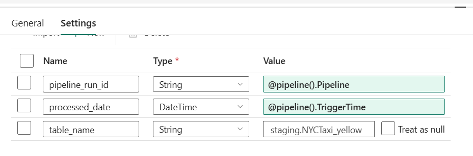

    pipeline_run_id : @pipeline().Pipeline (Pipeline variable)
    processed_date : @pipeline().TriggerTime (Pipeline variable)
    table_name : staging.NYCTaxi_yellow
					
### **Dataflow from staging to presentation:**
**Create Processing Table:**

    
		CREATE TABLE dbo.NYCTaxi_yellow
			(
				vendor varchar(50),
				tpep_pickup_datetime date,
				tpep_dropoff_datetime date,
				pu_borough varchar(100),
				pu_zone varchar(100),
				do_borough varchar(100),
				do_zone varchar(100),
				payment_method varchar(50),
				passenger_count int,
				trip_distance FLOAT,
				total_amount FLOAT
			);
			
### **Create a Dataflow Gen 2:** 
Dataflow_pres_processing_NYCTaxi
* Select NYCTaxi_Warehouse.staging.NYCTaxi_yellow table as data source.
* Apply some transformation :
1. we will remove these	columns : RatecodeID, staore_and_fwd_flag, fare_amount, extra, mta_tax, tip_amount, tolls_amount, improvement_surcharge, congestion_surcharge, Airport_fee)
2. Add a new conditional column : Vendor_name
   (for vendor names go to the data source-> Yellow Trips Data
   Dictionary: (https://www.nyc.gov/assets/tlc/downloads/pdf/data_dictionary_trip_records_yellow.pdf)
   if vendore id is:
   - 1 = Creative Mobile Technologies, LLC
   - 2 = Curb Mobility, LLC
   - 6 = Myle Technologies Inc
   - 7 = Helix
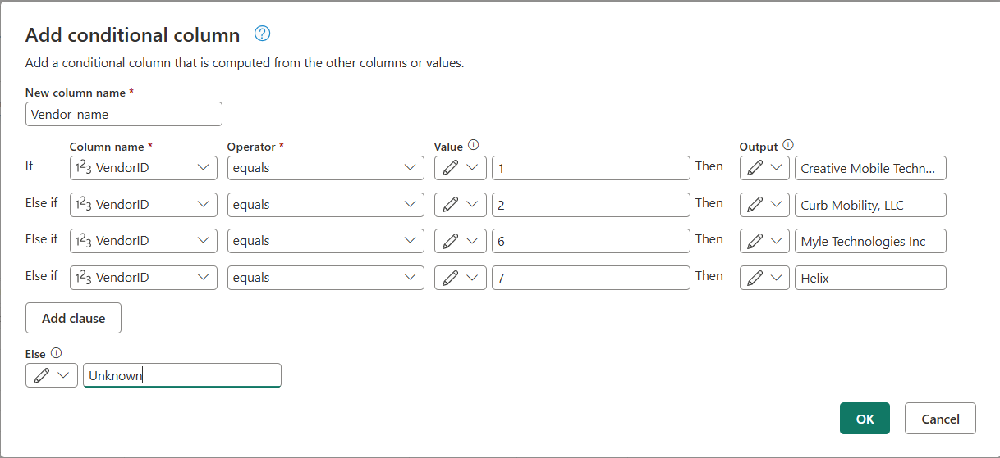

* Now we can remove the column : vendor_id.
* Add a new conditional column : Payment_method\
  (for vendor names go to the data source-> Yellow Trips Data
  Dictionary(https://www.nyc.gov/assets/tlc/downloads/pdf/data_dictionary_trip_records_yellow.pdf) \
  if payment_type is:
  - 0 = Flex Fare trip
  - 1 = Credit card
  - 2 = Cash
  - 3 = No charge
  - 4 = Dispute
  - 5 = Unknown
  - 6 = Voided trip
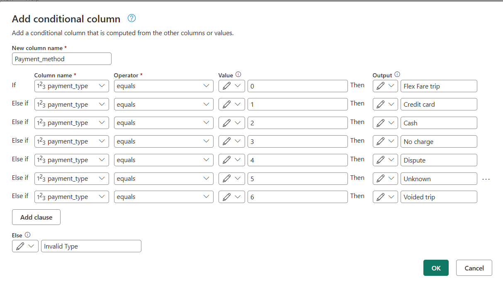 	
* Now we can remove the column : payment_type.
* change tpep_pickup_datetime and tpep_dropoff_datetime to contain date only.
* change data type of vendor_name, payment_method change the data type to text.
* Renamed all the columns to be consistant and in lower case.
   
Add another data source :  
NYCTaxi_Warehouse.staging.taxi_zone_lookup.\
Apply some transformation :
1. change datatype for LocationID to Whole Number.
2. Now merge these two data: Merge queries as new:
Merge NYCTaxi_yellow with taxi_zone_lookup based on\
NYCTaxi_yellow.pu_locationID = taxi_zone_lookup.LocationID\
do a **Left Outer join**.
3. Expand the data set and select the columns : Borough, Zone\
rename the coulmns pu_borough, pu_zone\
and remove the coulmn pu_locationID 
4. Another merge these two data: Merge queries as new:
Merge merge table with taxi_zone_lookup based on\ 
merge table.do_locationID = taxi_zone_lookup.LocationID\
do a **Left Outer join.**
5. Expand the data set and select the columns : Borough, Zone\
rename the coulmns do_borough, do_zone\
and remove the coulmn do_locationID
6. Rearrange the coulmns as:
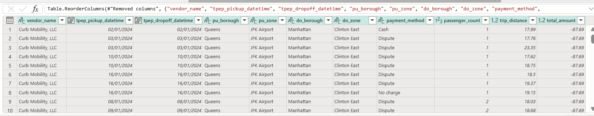	
> [!IMPORTANT]
> Ensure in the data flow -> diagram view we are on the latest step.
		
9. Now add a destination : Warehouse\
NYCTaxi_Warehouse -> Existing Table -> Select the new black table -> NYCTaxi_yellow(dbo schema)\
Do appened data.

10. Save and Run.

11. Create another pipeline : pl_pres_processing_nyctaxi
12. Add a dataflow activity : Process to presentation\
add the data flow in setting : Dataflow_pres_processing_NYCTaxi
13. Add Stored Procedure activity:
**Stored Procedure Activity :** SP for loading presentation metadata\
Stored Procedure name : NYCTaxi_Warehouse.metadata.insert_presentation_metadata\
(this Stored procedure is created to create a transaction log for each pipeline run
and store presentation metadata)

Stored procedure script:

        CREATE PROCEDURE metadata.insert_presentation_metadata
        @pipeline_run_id VARCHAR(255),
        @table_name VARCHAR(255),
        @processed_date DATETIME2
        AS
        INSERT INTO metadata.processing_log (pipeline_run_id, table_processed, rows_processed, latest_processed_pickup, processed_datetime)
        SELECT
            @pipeline_run_id AS pipeline_id,
            @table_name AS table_processed,
            COUNT(*) AS rows_processed,
            MAX(tpep_pickup_datetime) AS latest_processed_pickup,
            @processed_date AS processed_datetime
        FROM dbo.NYCTaxi_yellow;

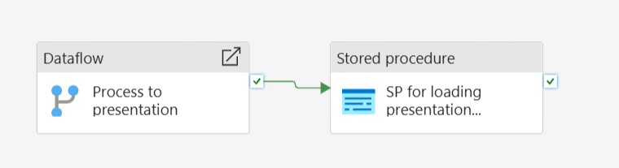

14. Add dynamic contect in the variable as above.
15. Create one orhestrating pipeline : pl_orchestrate_nyctaxi
16. Invoke Pipeline activity : Invoke staging pipeline\
and select the pipeline : pl_staging_nyctaxi_processing_pipeline\
connect the second activity from the first one.

17. Invoke Pipeline activity : Invoke presentation pipeline\
and select the pipeline : pl_pres_processing_nyctaxi
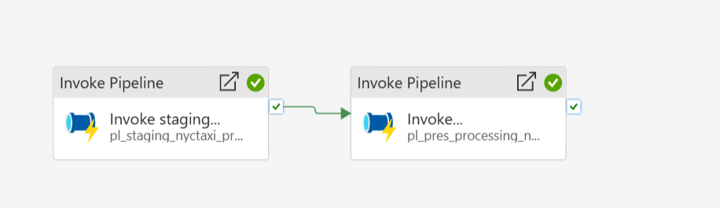

### **Semantic modelling and Power BI report:**

**Create new Semantic Model :** NYC_Taxi_Semantic_Model
1. add the table : dbo.NYCTaxi_yellow
2. Now go to workspace-> create one new item -> Report
3. select a published semantic model : NYC_Taxi_Semantic_Model
4. Create report.
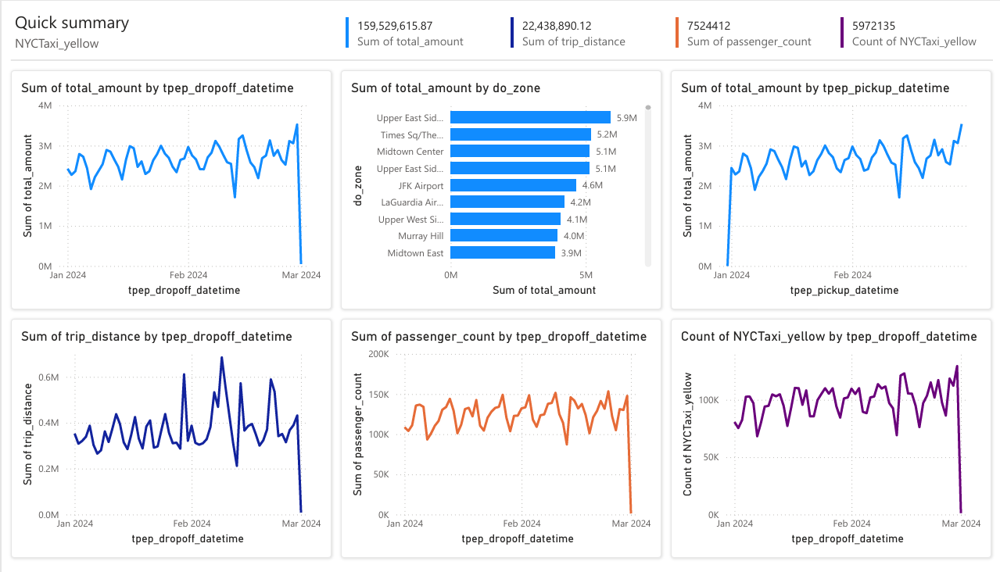

 

